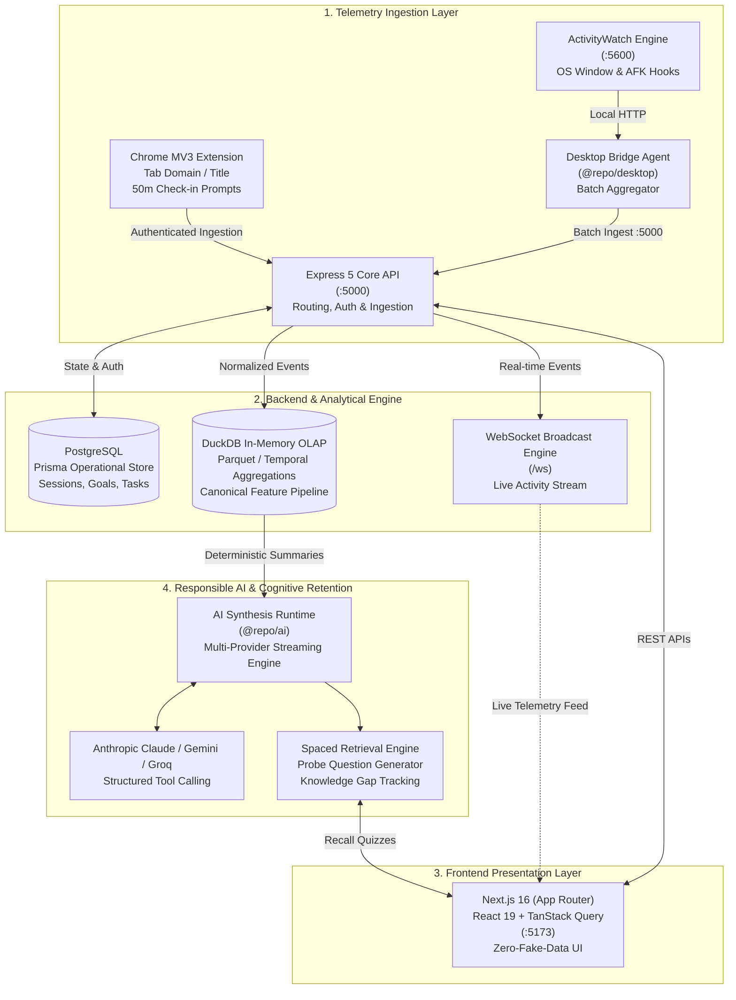

<div align="center">

# ProductiveHix

### The Behavioral Mirror & Cognitive Retention Engine

_Closing the loop between Intention, Behavior, Perception, Outcome, and Retained Learning._

[](https://turbo.build/repo)
[](https://nextjs.org/)
[](https://expressjs.com/)
[](https://duckdb.org/)
[](https://www.typescriptlang.org/)
[](https://nodejs.org/)
[](https://vitest.dev/)
[](#1-zero-fake-data-guarantee)
[](LICENSE)

<br />

```text
               ┌────────────────────────────────────────────────────────┐
               │                    DAILY INTENTION                     │
               │         Daily Goal + 1-3 Priorities + Key Tasks        │
               └───────────────────────────┬────────────────────────────┘
                                           │
                                           ▼
               ┌────────────────────────────────────────────────────────┐
               │                  DELIBERATE EXECUTION                  │
               │          Work Sessions & Dual-Sensor Telemetry         │
               └─────────────┬────────────────────────────┬─────────────┘
                             │                            │
                             ▼                            ▼
              ┌───────────────────────────┐  ┌───────────────────────────┐
              │    OBJECTIVE TELEMETRY    │  │    SUBJECTIVE INSIGHT     │
              │       ActivityWatch       │  │       50m Check-in        │
              │      Desktop & Browser    │  │      Gap Explanation      │
              └──────────────┬────────────┘  └────────────┬──────────────┘
                             │                            │
                             └─────────────┬──────────────┘
                                           │
                                           ▼
               ┌────────────────────────────────────────────────────────┐
               │             DUCKDB ANALYTICAL EVIDENCE LAYER           │
               │   Fast OLAP Temporal Aggregations & Canonical Features │
               └───────────────────────────┬────────────────────────────┘
                                           │
                                           ▼
               ┌────────────────────────────────────────────────────────┐
               │             RESPONSIBLE AI SYNTHESIS ENGINE            │
               │   Evidence-backed Insights, Probes & Retrieval Testing │
               └────────────────────────────────────────────────────────┘
```

</div>

---

## 🎯 Executive Vision: The Problem ProductiveHix Solves

Most productivity software is fundamentally broken because it belongs to one of two failed categories:

1. **Passive Spyware & Unactionable Trackers**: Tools that passively record thousands of raw window titles into colorful graphs. They produce guilt without insight, confuse pauses with "slacking," and fail to understand _why_ you opened an application.
2. **Wishful Todo Lists & Pomodoro Timers**: Tools that manage aspirations in a vacuum. They never cross-verify what actually happened on your machine against what you planned to accomplish, and they never test whether you retained what you learned.

### The Missing Link: Closed-Loop Epistemic Alignment

ProductiveHix is **not** a generic time tracker, a pomodoro widget, or an automated boss. It is a **personal behavioral mirror and cognitive retention engine** engineered to close the feedback loop between:

$$\text{Intention} \longleftrightarrow \text{Behavior} \longleftrightarrow \text{Perception} \longleftrightarrow \text{Outcome} \longleftrightarrow \text{Retained Learning}$$

It answers the **Five Foundational Questions** of human focus:

- **What did you intend?** _(Prospective daily goal & priorities)_
- **What actually happened?** _(Objective desktop & browser telemetry)_
- **What did you say happened?** _(Micro check-ins & gap explanations)_
- **What happened afterward?** _(Subjective outcome assessment)_
- **Did you actually retain what you learned?** _(Spaced retrieval active recall testing)_

---

## 🧭 The Four Kinds of Truth

Human focus and intellectual work cannot be reduced to a single sensor. ProductiveHix separates reality into **four non-overlapping layers of truth**:

| Truth Layer        | Nature                           | Core Source                                          | Key Invariant                                                                                                                                                      |
| :----------------- | :------------------------------- | :--------------------------------------------------- | :----------------------------------------------------------------------------------------------------------------------------------------------------------------- |
| **1. Intention**   | Prospective declaration          | Daily Goal, 1–3 Priorities, Planned Tasks            | **Never rewritten retroactively** to match reality. Divergence is the analytical signal.                                                                           |
| **2. Observation** | Objective telemetry              | ActivityWatch desktop hooks & browser extension      | **Contains zero subjective labels**. A window log says `Code.exe` or `docs.anthropic.com`, never "productive" or "unproductive" until evaluated against Intention. |
| **3. Reflection**  | Subjective self-report           | 50m periodic check-ins & inactivity gap explanations | Captures human context when away from machine (_"went to lecture"_, _"pair programmed offline"_).                                                                  |
| **4. Retention**   | Objective cognitive verification | Spaced retrieval prompts & probe assessments         | Staring at documentation for 2 hours $\ne$ learning. Verified only by active recall days later.                                                                    |

---

## ⚡ Inviolable Core Principles

ProductiveHix adheres to strict, locked architectural invariants:

### 1. Zero Fake Data Guarantee

- Never invent metrics, hardcoded trend lines (`+12%`), synthetic multipliers (`* 0.65`), or mocked baseline placeholders.
- If telemetry or statistical evidence is insufficient, the system explicitly renders `loading`, `empty`, or `insufficient-evidence` states.

### 2. AI Never Receives Raw Telemetry

- Raw ActivityWatch event streams (thousands of keystrokes, window switches, and URLs) are **never dumped into an LLM context window**.
- Telemetry is strictly aggregated into deterministic mathematical feature matrices via **DuckDB in-memory OLAP** projections and canonical analytical extractors before reaching AI models.

### 3. Missing Telemetry $\ne$ Slacking (The Gap Recovery Engine)

- Traditional trackers treat computer downtime as zero productivity. In ProductiveHix, time away is a **first-class analytical interval**.
- Five temporal concepts are decoupled:
  $$\text{Productive Day Boundary} \ne \text{Typical Sleep Time} \ne \text{Quiet Hours} \ne \text{Machine Availability} \ne \text{User Inactivity}$$
- When machine sleep or suspend occurs, the system records `Machine Unavailable` and prompts for user explanation upon return, converting voids into structured insight.

### 4. Decoupled Epistemic Hierarchy

Every synthesized behavioral observation maintains strict epistemic separation:

- **Observation**: _"You spent 47 minutes in terminal and editor."_
- **Pattern**: _"Terminal transitions spike 3x after 2:00 PM across the last 5 days."_
- **Insight**: _"Context switching in the afternoon correlates with a 40% reduction in completed priorities."_
- **Recommendation**: _"Consider scheduling deliberate coding blocks before noon."_

### 5. Decouple Goal Outcome from Task Completion

- Checking off 5/5 tasks does **not** mean a daily goal was achieved.
- Goal outcome is an honest, subjective end-of-day self-assessment, preventing users from gaming their own systems with trivial checkbox completions.

---

## 🏗️ End-to-End System Architecture



---

## 📦 Monorepo Architecture

Managed with [Turborepo](https://turbo.build/repo) and [pnpm](https://pnpm.io/) workspaces:

### Applications (`apps/`)

| Application                                                             | Technology                             | Port     | Description                                                                                                             |
| :---------------------------------------------------------------------- | :------------------------------------- | :------- | :---------------------------------------------------------------------------------------------------------------------- |
| [`apps/web`](file:///c:/Users/prate/ProductiveHix/apps/web)             | **Next.js 16**, React 19, Tailwind CSS | `:5173`  | Rich, responsive dashboard, real-time telemetry visualizer, daily intention planner, and spaced retrieval review.       |
| [`apps/api`](file:///c:/Users/prate/ProductiveHix/apps/api)             | **Express 5**, WebSocket (`ws`), Pino  | `:5000`  | High-throughput REST & WebSocket backend handling device pairing, batch telemetry ingestion, and session state.         |
| [`apps/desktop`](file:///c:/Users/prate/ProductiveHix/apps/desktop)     | **Node.js 24**, TypeScript, `tsup`     | CLI      | Native daemon bridging local ActivityWatch window/AFK buckets to ProductiveHix ingestion endpoints.                     |
| [`apps/extension`](file:///c:/Users/prate/ProductiveHix/apps/extension) | **Chrome Extension (Manifest V3)**     | Popup    | Context-aware browser tracker, focus guard tab protector, and non-intrusive 50-minute reflection trigger.               |
| [`apps/ai`](file:///c:/Users/prate/ProductiveHix/apps/ai)               | **TypeScript**, Streaming SDKs         | Internal | Multi-provider runtime supporting Anthropic Claude, Google Gemini, and Groq with streaming and structured tool calling. |

### Core Packages (`packages/`)

| Package                                                                              | Purpose                                                                                                         |
| :----------------------------------------------------------------------------------- | :-------------------------------------------------------------------------------------------------------------- |
| [`@repo/analytics`](file:///c:/Users/prate/ProductiveHix/packages/analytics)         | Mathematical detectors, task fragmentation estimators, day/session feature pipelines, and baseline calculators. |
| [`@repo/data`](file:///c:/Users/prate/ProductiveHix/packages/data)                   | High-speed DuckDB queries, SQL window aggregation functions, and normalized telemetry ingestion projection.     |
| [`@repo/db`](file:///c:/Users/prate/ProductiveHix/packages/db)                       | Prisma schema, PostgreSQL client, migrations, and phase invariant database constraints.                         |
| [`@repo/telemetry`](file:///c:/Users/prate/ProductiveHix/packages/telemetry)         | Telemetry schemas, deduplication filters, batch normalization protocols, and payload types.                     |
| [`@repo/activitywatch`](file:///c:/Users/prate/ProductiveHix/packages/activitywatch) | Resilient client for ActivityWatch server discovery, bucket querying, and connection retry backoffs.            |
| [`@repo/validation`](file:///c:/Users/prate/ProductiveHix/packages/validation)       | Zod schemas, semantic timeline validation, and data contract assertion rules.                                   |
| [`@repo/types`](file:///c:/Users/prate/ProductiveHix/packages/types)                 | Canonical domain TypeScript interfaces shared across all monorepo applications.                                 |
| [`@repo/ui`](file:///c:/Users/prate/ProductiveHix/packages/ui)                       | Reusable UI design system components and foundational tokens.                                                   |

---

## 🤖 The Responsible AI Retention Engine

ProductiveHix uses Artificial Intelligence not as a chat gimmick, but as an **epistemically grounded cognitive accelerator**:

```text
  [ 2-Hour Deep Focus Session on LLM Tool Use ]
                     │
                     ▼
  [ DuckDB Feature Extractor aggregates:
    - 78% active focus in VS Code
    - 22% documentation research on docs.anthropic.com
    - Zero social media / task switches ]
                     │
                     ▼
  [ LLM Synthesis: Extracts core mental models worked on ]
                     │
                     ▼
  [ Automated Spaced Retrieval Schedule ]
  ├── Day 2:  Active recall probe question generated
  ├── Day 7:  Application scenario verification
  └── Day 14: Synthesized knowledge retention audit
```

- **No Hallucination**: AI receives only mathematical feature summaries, never raw event noise.
- **Deterministic Guardrails**: Output format is enforced via structured tool calling and validated by `@repo/validation` schemas.
- **Closed-Loop Memory**: Surfaces unverified knowledge gaps and incorporates past forgotten concepts into tomorrow's intention planning.

---

## 🚀 Quick Start & Local Development

### Prerequisites

- **Node.js**: `v24.0.0` or higher
- **Package Manager**: `pnpm` (`v11.25.0`+)
- **ActivityWatch**: (Optional but recommended for live desktop telemetry) Running on default port `5600`

### 1. Clone & Install

```bash
git clone https://github.com/PrateekSingh43/ProductiveHix.git
cd ProductiveHix
pnpm install
```

### 2. Environment Configuration

Copy development templates:

```bash
cp apps/api/.env.example apps/api/.env
cp apps/web/.env.example apps/web/.env
cp apps/desktop/.env.example apps/desktop/.env
```

_Default Ports:_

- **Express API**: `http://localhost:5000` (WebSocket: `ws://localhost:5000/ws`)
- **Next.js Web UI**: `http://localhost:5173`
- **ActivityWatch**: `http://localhost:5600`

### 3. Initialize Database

```bash
pnpm --filter @repo/db db:generate
```

### 4. Run Development Services

Start all monorepo services concurrently via Turborepo:

```bash
pnpm dev
```

Or run individual services in dedicated terminals:

```bash
# Terminal 1: Express API (:5000)
pnpm --filter @repo/api dev

# Terminal 2: Next.js Frontend (:5173)
pnpm --filter web dev

# Terminal 3: ActivityWatch Desktop Bridge
pnpm --filter @repo/desktop dev

# Terminal 4: Chrome Extension Watcher
pnpm --filter @repo/extension dev
```

Visit [`http://localhost:5173`](http://localhost:5173) to view the ProductiveHix dashboard.

---

## 🧪 Verification & Quality Invariants

ProductiveHix enforces zero regressions with strict workspace validation commands:

```bash
# Strict TypeScript compilation across all 13 packages
pnpm check-types

# Automated Vitest suites (Analytical invariants, DuckDB OLAP, WebSocket, AI streaming)
pnpm test

# Monorepo linting
pnpm lint

# Production bundle builds (Next.js Turbopack + tsup)
pnpm build
```

---

## 📖 System Specifications & Engineering Invariants

The repository enforces strict architectural contracts across every package:

- 📐 **Master System Blueprint**: Locked behavioral mental model, the Four Kinds of Truth, DuckDB analytical aggregation pipelines, and closed-loop cognitive retention loops.
- 📐 **UX Interaction Contract**: Zero-fake-data presentation rules, state machine contracts, and clean page layouts.
- 📐 **Local Telemetry & Ingestion**: ActivityWatch native client discovery, batch synchronization, and graceful error boundaries.

---

## ⚖️ License

Distributed under the **MIT License**. See [`LICENSE`](LICENSE) for more information.

<div align="center">
<sub>Crafted with engineering rigor for deep work, cognitive mastery, and genuine intellectual growth.</sub>
</div>
