# ProductiveHix — Phase 2 Visual Review & Future Reflection
## Design System Tokens, Layout Architecture & Application Shell Corrections

This directory archives the definitive visual verification evidence, component behavior states, and design-system primitives created during **Phase 2 (Design System Tokens & Application Shell)** under the locked **ProductiveHix UX Contract v1.3**, incorporating all visual review corrections.

---

## 1. Architectural Principles Applied

1. **Intention → Execution → Observation → Reflection**:
   - Every surface has a singular, unambiguous mental model role.
   - **Home (`/`)**: 15-second glanceable status summary. Strictly prohibited from acting as an operational work surface.
   - **Today (`/today`)**: Operational work surface where intention (Daily Goal + Priorities), execution (Current Focus / NOW), task actions, and observational reality meet.
2. **Data Honesty Invariant**:
   - Zero fake baseline placeholders (`baseline-placeholder.tsx` deleted).
   - Zero fake multipliers (no `* 0.65` coding time or `* 0.2` browser splits).
   - Zero fake trends (no `+12%` artificial trend indicators).
   - A real `0` is strictly distinct from `empty`, `insufficient`, or `unavailable`.
3. **Observational Semantics**:
   - Raw observed telemetry is labeled with objective classifications (*Desktop application*, *Browser activity*, *AFK / Idle*, *Other*), never labeled as "deep work", "focus", or "efficiency" without formally validated computation.
4. **Restrained, High-Density Dark Aesthetics**:
   - Clean semantic surfaces (`#0A0A0C`, `#111115`, `#18181D`), subtle borders (`#26262E`), subdued typography, zero decorative glowing blur circles or glassmorphism. Full `prefers-reduced-motion` compliance.

---

## 2. Screenshot Directory & Detailed Explanations

### A. Home (`/`)

#### `01-overview-home-glanceable-summary.png`
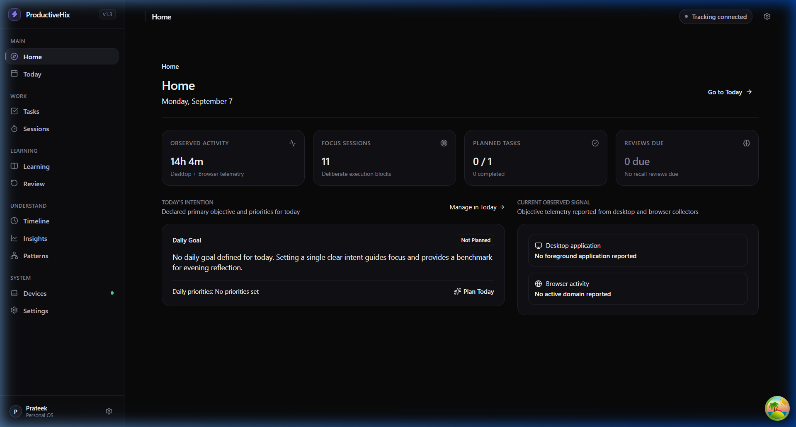
- **Role**: 15-second glanceable status summary.
- **Corrections Verified**:
  - Main page title is canonically **Home** (not "Overview").
  - Breadcrumb displays **Home**.
  - Global shell header is quiet (removed generic repeated subtitle *"Your personal operating system"*).
  - StatCard naming matches product ontology: **"Reviews Due"** (no longer "Recall Validation"), **"Observed Activity"**, **"Focus Sessions"**, **"Planned Tasks"**.
  - Activity transparency: "Desktop + Browser telemetry" with honest active time.
  - Today's Intention card uses canonical term **"Daily Goal"** and displays **"Daily priorities: No priorities set"** (avoiding progress-counter confusion like "0 / 3").
  - Current Observed Signal card presents direct active application and browser domain without redundantly repeating global collector connection status.

---

### B. Today Operational Surface (`/today`)

#### `02-today-no-task-selected.png`
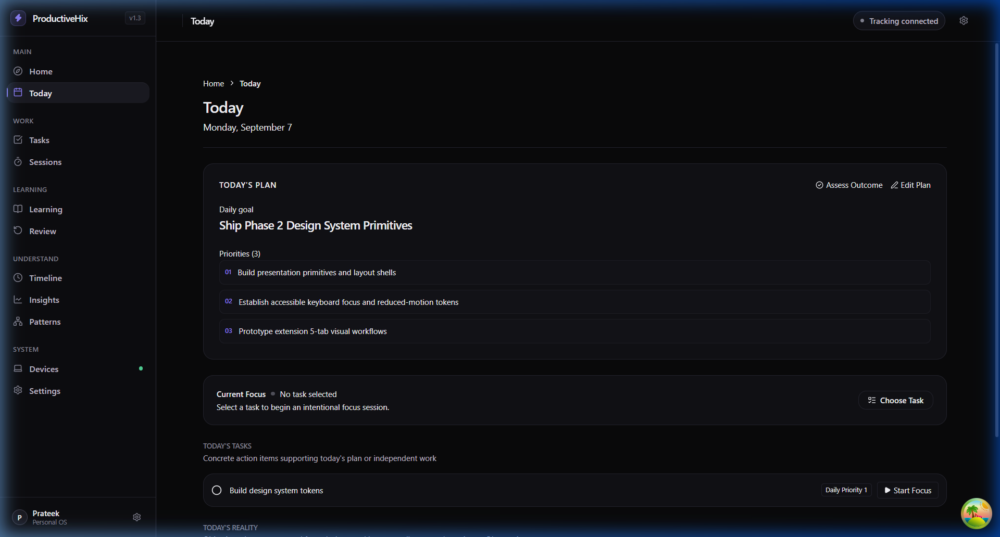
- **Role**: Operational work surface initial state with no task selected for focus.
- **Corrections Verified**:
  - **Quiet PageHeader**: Developer Goal State dropdown completely removed from the production UI.
  - **GoalCard**: Displays major section kicker **"TODAY'S PLAN"** and canonical label **"Daily goal"**.
  - **CurrentFocusCard Semantic Consistency**: When no task is selected, shows **"No task selected"** and a **"[ Choose Task ]"** button. The interface strictly avoids presenting "Start Focus" when no task is attached, adhering to the invariant that a Session must be attached to a Task.

#### `04-today-focus-session-active.png`
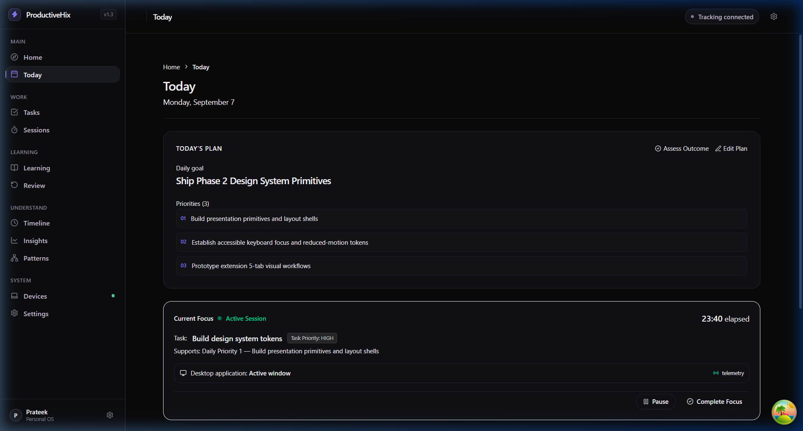
- **Role**: Active execution state on the operational work surface (the **NOW** layer).
- **Corrections Verified**:
  - **Session Identity Stronger Than Timer**: Card features an active pulse with **"Active Session"** and **"{time} elapsed"**, framing the timer as an attribute of the session rather than a countdown tool.
  - **Unambiguous Priority Context**: Displays **"Supports: Daily Priority 1 — Build presentation primitives and layout shells"** and **"Task Priority: HIGH"**, completely removing bare `P1` ambiguity.
  - **Standardized Action**: Task row uses **"Start Focus"** with play icon. Controls feature **"[ Pause ]"** and **"[ Complete Focus ]"**.

#### `08-today-goal-state-outcome-assessed.png`
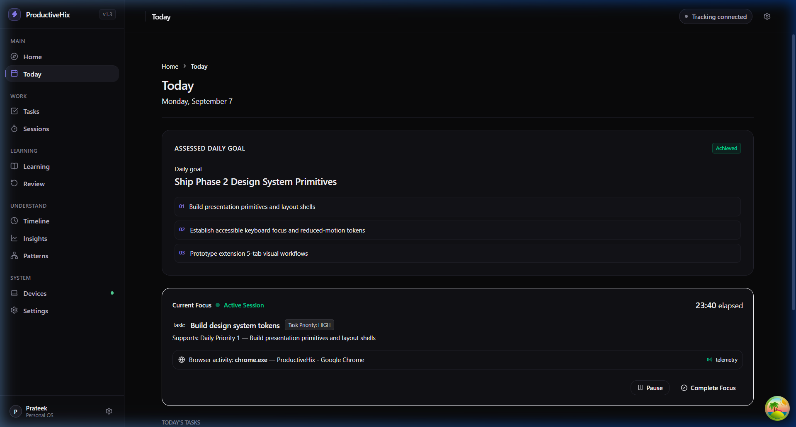
- **Role**: Assessed goal state following end-of-day outcome reflection.
- **Corrections Verified**:
  - **Outcome Assessment Copy**: Prompt simplified to user-facing **"Did you achieve today's goal?"** with options *Achieved*, *Partially achieved*, *Not achieved*, and *Not assessed*.
  - **Decoupled Lifecycle & Value**: Clean transition to **"ASSESSED DAILY GOAL"** with green **"Achieved"** badge. Eliminates contradictory UI states where an unassessed goal could be labeled as assessed.

#### `10-today-operational-surface-scrolled.png`
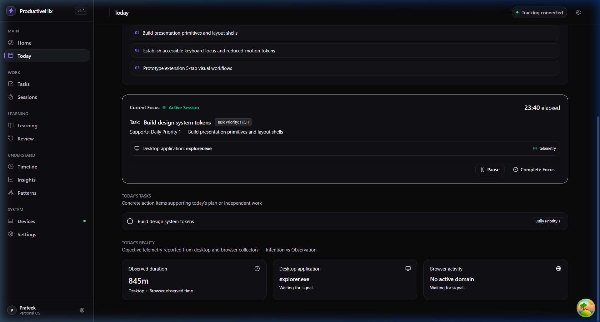
- **Role**: Lower operational work surface showing Today's Tasks and Today's Reality.
- **Corrections Verified**:
  - Major section kickers in uppercase: **"TODAY'S TASKS"**, **"TODAY'S REALITY"**.
  - Content labels in sentence/title case: **"Observed duration"**, **"Desktop application"**, **"Browser activity"**.
  - Task relationship semantics: Tasks can support a Daily Priority or Goal, or remain independent.

---

### C. Tasks (`/tasks`)

#### `11-tasks-management-view.png`
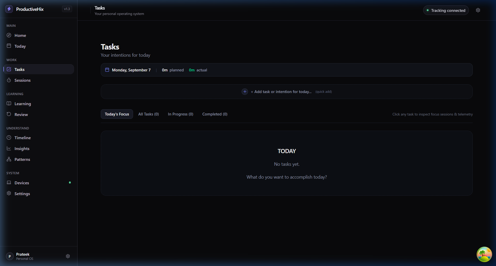
- **Role**: Actionable backlog and priority alignment surface.
- **Components Shown**:
  - Filter tabs (*Today's Focus*, *All Tasks*, *In Progress*, *Completed*).
  - Clean task items with checkbox toggles, priority badges, and duration estimates.

#### `12-tasks-quick-add-modal.png`
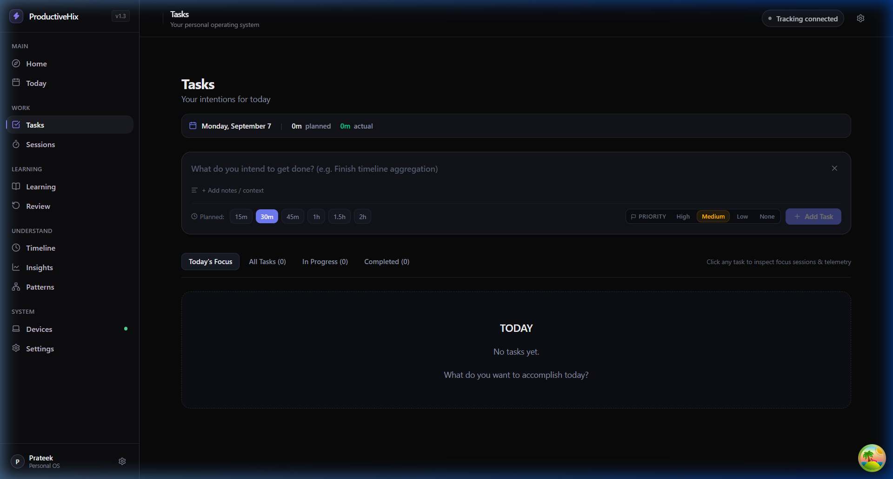
- **Role**: Fast keyboard-accessible task creation modal.

#### `13-tasks-created-verification.png`
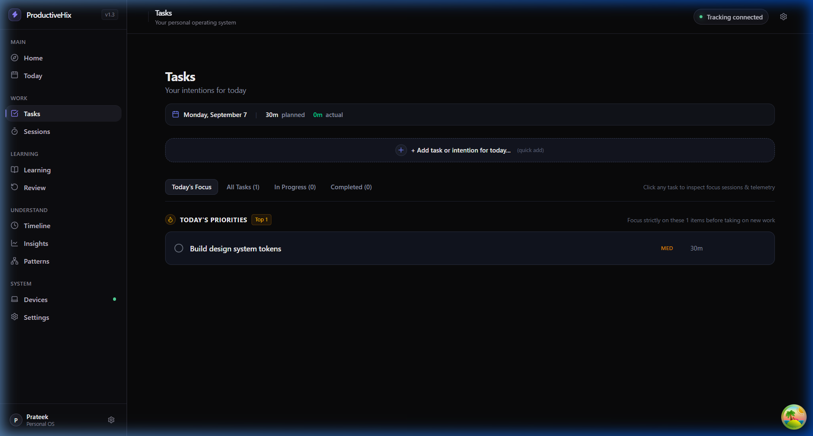
- **Role**: Verification that new tasks persist into the task store and appear in filter tabs immediately.

---

### D. Work Execution & Telemetry History (`/sessions`, `/timeline`)

#### `14-sessions-history-honest-empty-state.png`
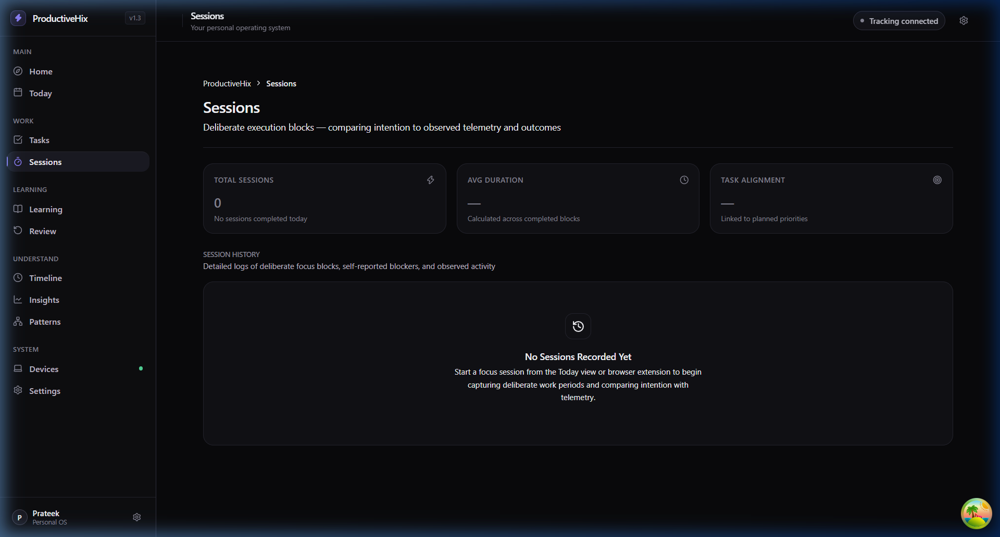
- **Role**: Deliberate focus session execution logs.
- **Components Shown**:
  - `StatCard` row with explicit `empty` states (*Total Sessions: 0*, *Avg Duration: —*, *Task Alignment: —*).
  - `EmptyState` component for Session History explaining how focus sessions connect intention to telemetry.
- **Reflection**: Replaced previous fake static tables containing hardcoded dates (Sep 1–4) and fake sparklines.

#### `17-timeline-activity-telemetry.png`
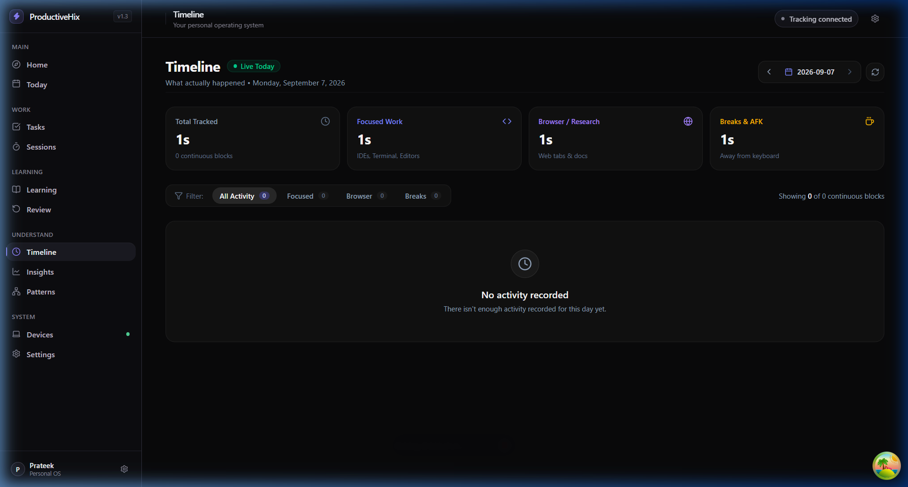
- **Role**: Raw observational telemetry log with objective classifications.
- **Components Shown**:
  - Total active time, Focus blocks, Context switches.
  - Objective classification blocks (*Focused Work*, *Browser / Research*, *Breaks & AFK*).

---

### E. Learning & Recall System (`/learning`, `/review`)

#### `15-learning-topics-honest-empty-state.png`
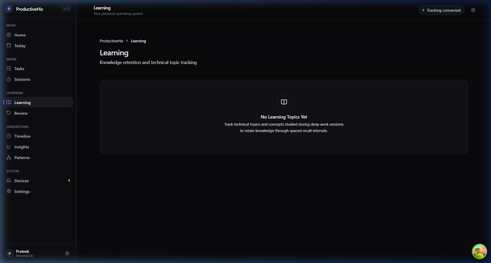
- **Role**: Technical knowledge topics studied during work sessions.
- **Components Shown**:
  - Clean `PageHeader` with breadcrumb navigation.
  - `EmptyState` explaining that topics studied during coding sessions appear here.
- **Reflection**: Replaced previous fake baseline placeholder with fake "8 tracked topics" and "82% recall".

#### `16-review-delayed-recall-empty-state.png`
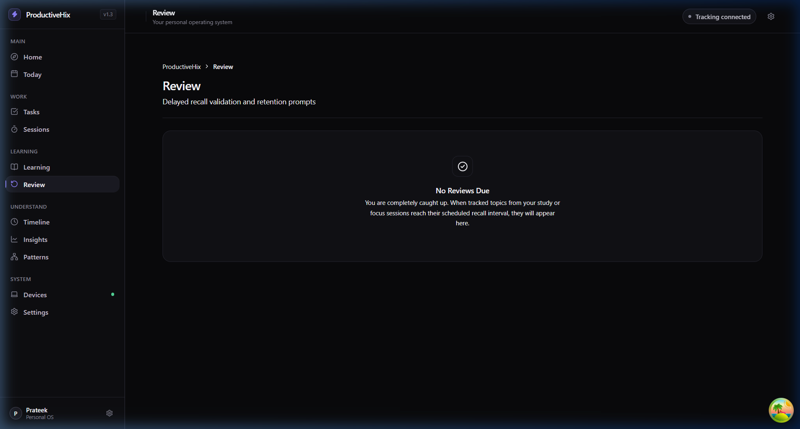
- **Role**: Delayed spaced recall verification.
- **Components Shown**:
  - Honest `EmptyState` ("No Reviews Due — You are completely caught up").
- **Reflection**: Removed hardcoded "2 due" sidebar badge and fake preview cards.

---

### F. Analytical Synthesis Surfaces (`/insights`, `/patterns`)

#### `18-insights-insufficient-data-state.png`
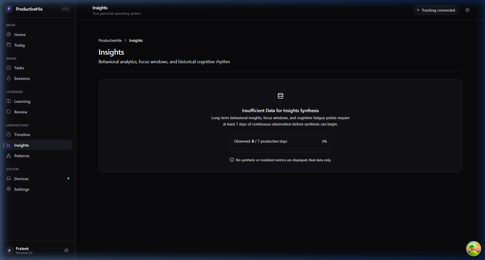
- **Role**: Long-term behavioral analytics and cognitive fatigue rhythm.
- **Components Shown**:
  - `InsufficientDataState` primitive displaying honest progress bar: **0 / 7 productive days** recorded.
  - Explanatory note: "No synthetic or modeled metrics are displayed. Real data only."

#### `19-patterns-insufficient-data-state.png`
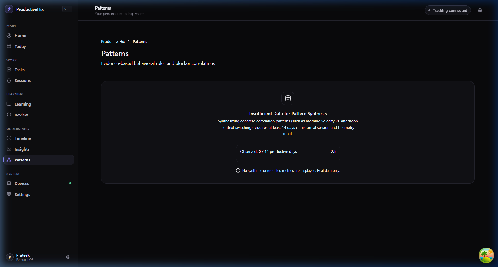
- **Role**: Evidence-based behavioral correlation rules.
- **Components Shown**:
  - `InsufficientDataState` primitive displaying honest progress bar: **0 / 14 productive days** required for correlation synthesis.

---

### G. System & Diagnostic Surfaces (`/devices`, `/settings`)

#### `20-devices-diagnostics-bridge-status.png`
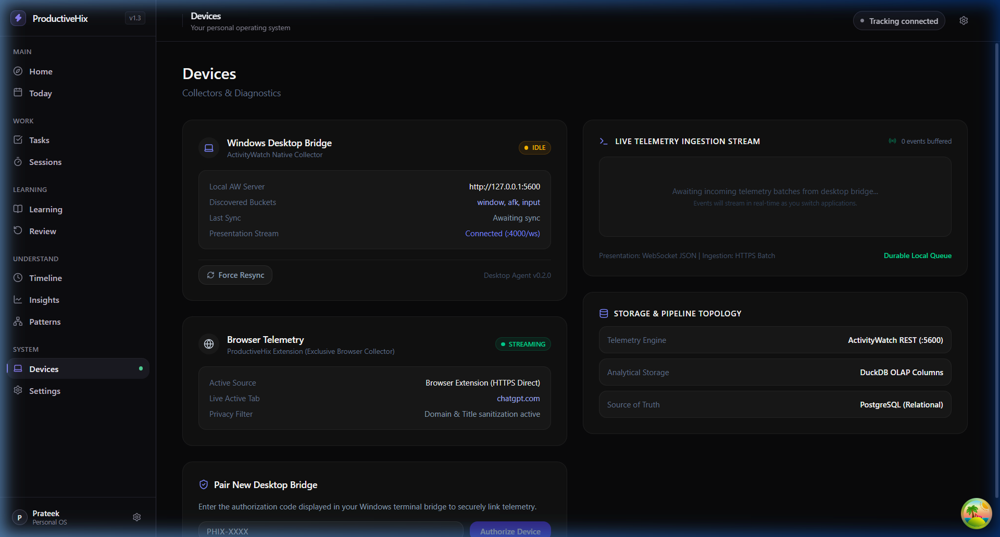
- **Role**: Local topology status for Desktop Bridge, Extension, and Storage.

#### `21-settings-preferences-and-quiet-hours.png`
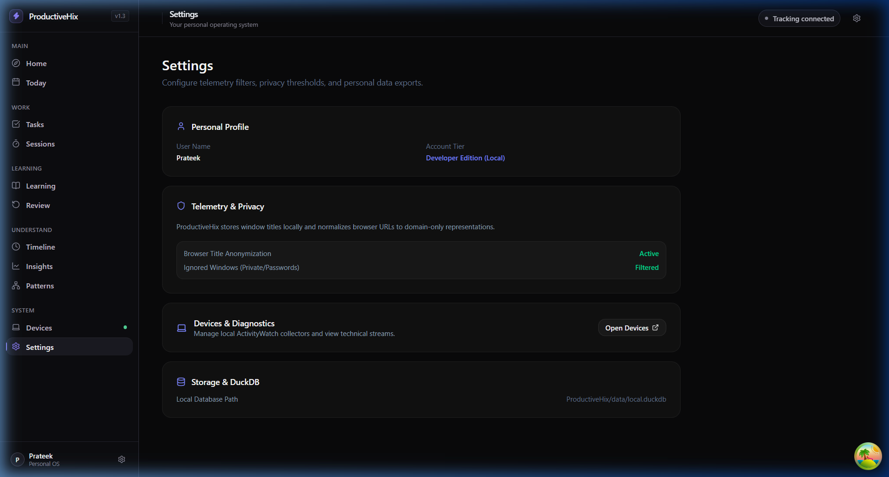
- **Role**: Preferences, sleep schedule / quiet hours, and privacy filtering.
- **Components Shown**:
  - Decoupled temporal configuration: Sleep Start (`23:00`), Sleep End (`07:00`), Day Boundary, and Quiet Hours.

---

## 3. Future Reflections for Upcoming Phases

### Phase 3 (Domain Models & Persistence)
- **DailyPlan Entity**: Create Prisma model for `DailyPlan` containing `id`, `date`, `goal`, `outcome` (`ACHIEVED`, `PARTIALLY_ACHIEVED`, `NOT_ACHIEVED`, `UNASSESSED`), and 1–3 `DailyPriority` items.
- **Productive Day Resolver**: Implement the 5 decoupled temporal boundaries (`Productive Day Boundary` $\neq$ `Typical Sleep Time` $\neq$ `Machine Availability` $\neq$ `Quiet Hours` $\neq$ `User Inactivity`).
- **Task Mapping**: Add optional foreign key linking `Task` to `DailyPriority` (preserving optionality so tasks can also link to Goal directly or remain independent).

### Phase 4 (Telemetry & ActivityWatch Clarification)
- **Desktop/Extension Separation**: Extension collects tab and domain activity via WebExtensions API; desktop watcher communicates with local ActivityWatch.
- **No Mirroring**: Confirmed extension does not push heartbeats to ActivityWatch `localhost:5600`.
- **Inactivity vs. Offline**: When desktop agent is not running, telemetry state is `offline` or `unavailable`, never `idle`.

### Phase 5 (Reflection & Review Engine)
- **Reflect vs. Review Decoupling**: Keep hourly check-in reflections (qualitative flow/blockers) strictly separate from spaced learning reviews (delayed recall questions).
